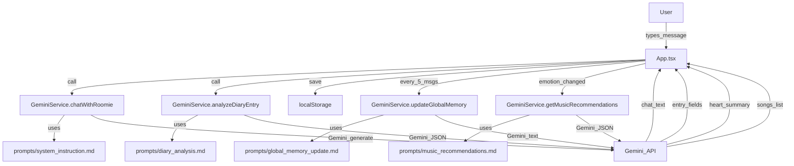

# Roomie — Emotional Companion Robot

Roomie is a gentle emotional companion web app that chats with you like a diary friend, helps you reflect, tracks mood trends, and keeps a small “Heart Database” in your browser.

It’s built with **Vite + React + TypeScript**, and uses **Google Gemini** (via `@google/genai`) for:
- empathetic chat responses (stays “in character” as Roomie)
- structured diary analysis (emotion + category + 1-sentence summary)
- mood-appropriate music recommendations (title + artist)
- a periodically updated “Heart Summary” (3–5 sentences)

## Features

- **Robot Chat (Diary Mode)**: talk to Roomie in a chat UI.
- **Heart Database (local-first)**:
  - chat history, diary entries, and your “Heart Summary” are saved in **`localStorage`**
  - **Export JSON** and **Import JSON** (portable backup)
  - **Factory Reset** wipes the Heart Database
- **Dashboard**
  - **Permanent Heart Summary** (synced from recent chats + entries)
  - **Mood Journey** chart (last 7 entries)
  - **Roomie’s Music Corner** (3 Gemini-recommended songs for your current mood)
  - **Memory Log** (diary entry summaries)
  - **Raw JSON viewer** (what’s currently stored)
- **Focus Mode**: a playful “lock away device” screen (UI interaction; not an OS-level lock).

## Screens & navigation

Roomie has 3 main views (top-right icons):
- **Chat**: talk to Roomie and create new reflections
- **Database**: dashboard (analytics / memories / raw JSON)
- **Focus**: focus-mode screen

## Tech stack

- **Runtime/build**: Vite 6
- **UI**: React 19
- **Charts**: Recharts
- **AI**: Google GenAI SDK (`@google/genai`)
- **Styling**: Tailwind via CDN (see `index.html`)

## Getting started

### Prerequisites

- **Node.js** (recommended: current LTS)
- **npm** (comes with Node)
- A **Gemini API key**

### Install

```bash
npm install
```

### Configure environment variables

Create a `.env` file in the project root:

```bash
GEMINI_API_KEY=your_api_key_here
```

#### Windows (PowerShell) alternatives

If you prefer to set `GEMINI_API_KEY` at the user level directly from PowerShell, you can use one of the following options instead of (or in addition to) a `.env` file:

- **Option 1: `setx` + verify in the current shell**

  ```powershell
  setx GEMINI_API_KEY "your_api_key_here"
  echo $env:GEMINI_API_KEY
  ```

  Note: `setx` writes to your persistent user environment. You may need to open a **new** PowerShell window for the new value to appear automatically in `$env:GEMINI_API_KEY`.

- **Option 2: .NET API from PowerShell + verify via `Env:` drive**

  ```powershell
  [System.Environment]::SetEnvironmentVariable("GEMINI_API_KEY", "your_api_key_here", "User")
  Get-ChildItem Env:GEMINI_API_KEY
  ```

After changing environment variables with either method, **restart your dev server** (stop and re-run `npm run dev`) so Vite picks up the new value.

Roomie’s Vite config injects this value into the client bundle:
- `process.env.API_KEY` and `process.env.GEMINI_API_KEY` are defined from `GEMINI_API_KEY` (see `vite.config.ts`)

Important: this is a **client-side app**, so the key is included in the built frontend bundle. Treat it accordingly (see [Security & privacy](#security--privacy)).

### Run (dev)

```bash
npm run dev
```

Then open `http://localhost:3000`.

### Build & preview

```bash
npm run build
npm run preview
```

## How Roomie works

### High-level flow

When you send a message in Chat:

1. **Chat reply**: Roomie generates an empathetic response using Gemini.
2. **Diary analysis (background)**: the same user text is analyzed into structured JSON:
   - `emotion` (Happy/Calm/Sad/Anxious/Excited/Tired)
   - `category` (Personal Feelings/Relationships/Books & Dreams/General)
   - `summary` (1 sentence)
3. **Local save**: the analyzed diary entry is stored in `localStorage`.
4. **Periodic “Heart Sync”**: every 5 messages, Roomie updates the permanent “Heart Summary” using recent chat + diary summaries.

### Architecture diagram



### Prompts

Roomie loads prompt templates from the `prompts/` directory at runtime:
- `prompts/system_instruction.md` — Roomie’s personality + injected memory context
- `prompts/diary_analysis.md` — structured analysis prompt
- `prompts/global_memory_update.md` — updates the permanent “Heart Summary”
- `prompts/music_recommendations.md` — recommends 3 songs for the current emotion

## Heart Database (storage format)

All data is stored in the browser (local-first) under these keys:

- **`roomie_db_entries`**: array of diary entries
- **`roomie_db_history`**: chat history (user + model messages)
- **`roomie_db_memory`**: global memory object (`summary`, `lastUpdated`)

### Diary entry shape

Each entry (in `roomie_db_entries`) looks like:

```json
{
  "id": "string",
  "timestamp": 1710000000000,
  "content": "user text",
  "emotion": "Calm",
  "category": "General",
  "summary": "A concise, heartwarming 1-sentence summary."
}
```

### Export / import JSON

- **Export**: downloads a JSON file containing `entries`, `chatHistory`, `globalMemory`, plus an `exportDate`.
- **Import**: accepts a JSON file and replaces the in-browser database (expects `entries`, `chatHistory`, and `globalMemory`).

### Reset

“Reset” clears chat history, diary entries, memory, and calls `localStorage.clear()` (wipes everything this app stored).

## Rate limits & reliability

Roomie includes retry + exponential backoff for rate-limit/quota errors (HTTP `429` / `RESOURCE_EXHAUSTED`):
- it retries up to several times with increasing delays
- the UI shows a friendly message when quota/rate limits are hit

If you see frequent 429s:
- slow down consecutive messages
- wait ~30–60 seconds and try again
- check your Gemini quota/plan

## Project structure

Key files/folders:

- `App.tsx` — main UI, view routing, localStorage, export/import/reset, and the chat + analysis flow
- `services/geminiService.ts` — all Gemini calls, prompt loading, and retry/backoff logic
- `prompts/` — markdown prompt templates used by the Gemini service
- `components/RobotFace.tsx` — animated robot face tied to emotion + speaking state
- `components/EmotionChart.tsx` — “Mood Journey” chart (Recharts)
- `components/MusicPlayer.tsx` — fetches music recommendations per emotion
- `types.ts` — shared enums and types
- `vite.config.ts` — Vite server config + API key injection
- `index.html` / `index.tsx` — app entry and global styles/resources

## Security & privacy

- **Local-first storage**: your Heart Database is stored in your browser’s `localStorage` until you export/import/reset.
- **AI requests**: when you chat, analyze entries, sync memory, or fetch music recommendations, the relevant text is sent to **Gemini**.
- **API key exposure**: this is a frontend-only app, so `GEMINI_API_KEY` is injected into the client bundle. For stronger security, consider moving Gemini calls to a server-side proxy (future improvement).
- **Exports**: exported JSON files contain your reflections and summaries—treat them as sensitive personal data.

## Troubleshooting

### The app loads but AI doesn’t respond

- Ensure you created `.env` with **`GEMINI_API_KEY`**.
- Restart the dev server after changing `.env`.
- Check the browser console for auth errors.

### “Roomie is taking a long breath (Rate limit)”

- You’re hitting quota/rate limits (429). Wait and try again.
- The app already retries with backoff, but it can still fail under heavy usage.

### Prompts aren’t loading / Roomie acts “generic”

Roomie fetches prompt files from `./prompts/*.md`. If those requests fail:
- ensure `prompts/` is present in the built output (Vite should copy static assets that are referenced via fetch only if served; if you run into issues in production, you may need to place prompts under Vite’s `public/` folder or configure asset copying)
- check the Network tab for `404` on prompt files

### Import fails

- Only JSON exports with the expected shape will import.
- Required keys: `entries`, `chatHistory`, `globalMemory`.

### Blank screen

- Check Node/npm versions and reinstall: `rm -rf node_modules` then `npm install` (or the Windows equivalent).
- Check for runtime errors in the browser console.

## Contributing
PRs and improvements are welcome.

Thanks go to these wonderful people:
- **[Jisoo](https://github.com/jisoo1129a)**: Designed ideas together, Searched for STT modules.

### Development workflow

1. Install deps: `npm install`
2. Add `.env` with `GEMINI_API_KEY`
3. Run dev server: `npm run dev`

### Adding a new emotion

If you add an emotion:
- update `EmotionType` in `types.ts`
- update chart mapping in `components/EmotionChart.tsx`
- update prompt constraints in `services/geminiService.ts` (response schema description)
- update robot face rendering in `components/RobotFace.tsx`

### Editing Roomie’s personality

Adjust `prompts/system_instruction.md`. The `{{GLOBAL_SUMMARY}}` and `{{REFLECTION_CONTEXT}}` placeholders are injected at runtime.

## Roadmap (ideas)

- **Set environments and Run systems in Raspberry Pi to connect hardware** (screen, camera, wheels, etc.)
- **Real music playback integration** (e.g., Spotify/YouTube links)
- **More analytics** (weekly/monthly trends, category breakdown)
- Server-side Gemini proxy (avoid exposing API key in the client)
- Optional user auth + encrypted cloud sync for Heart Database
- Better production asset handling for prompts (serve via `public/`)
